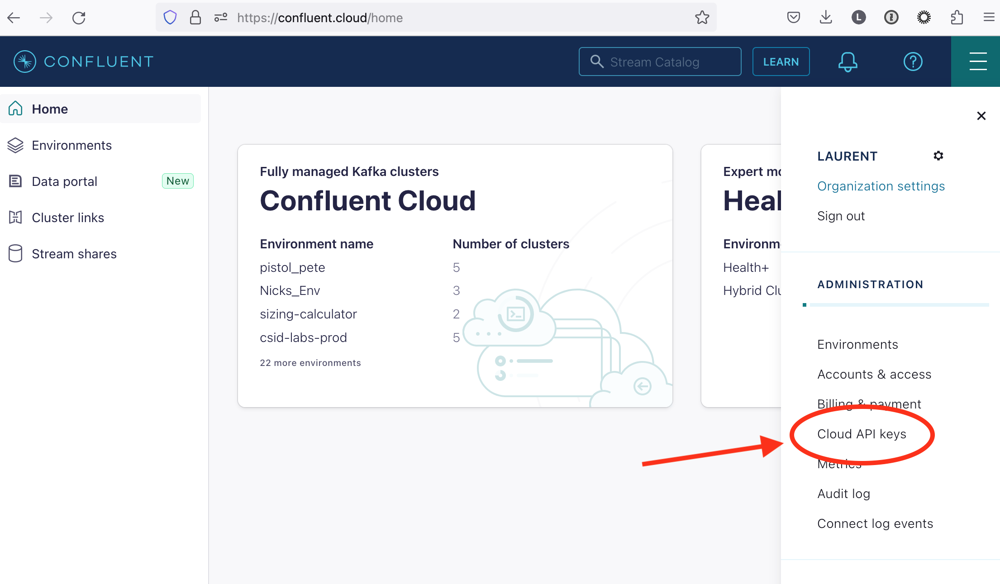
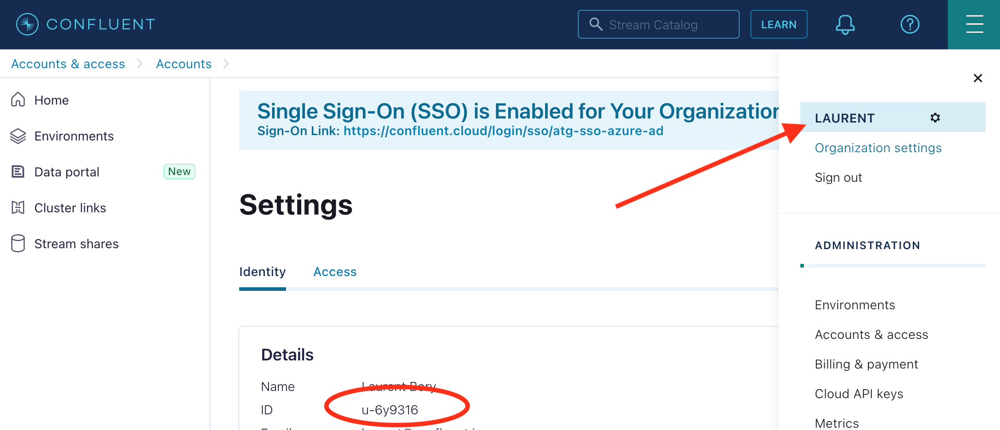
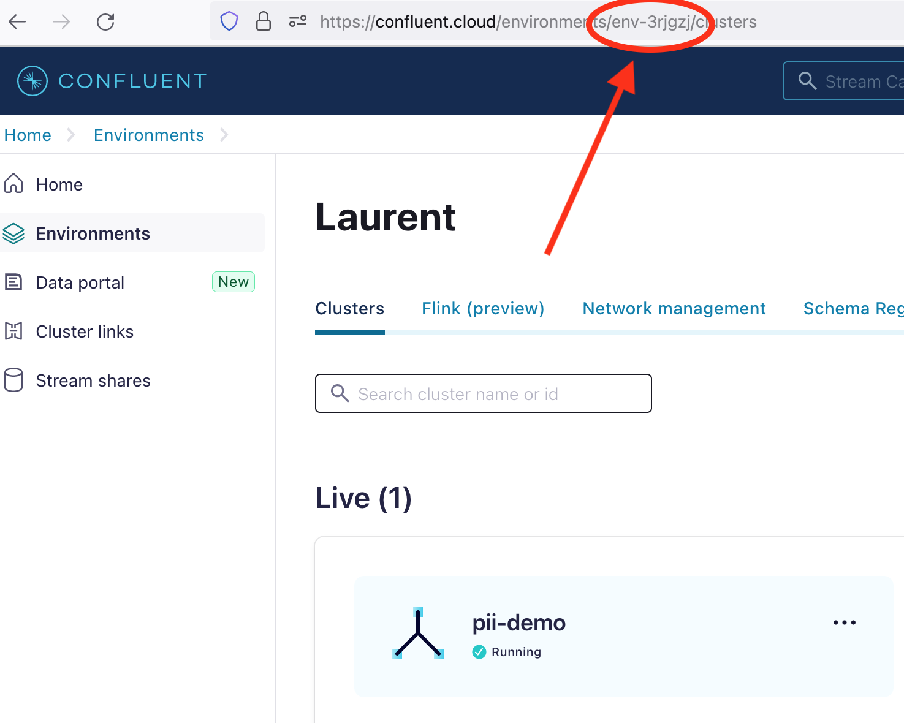
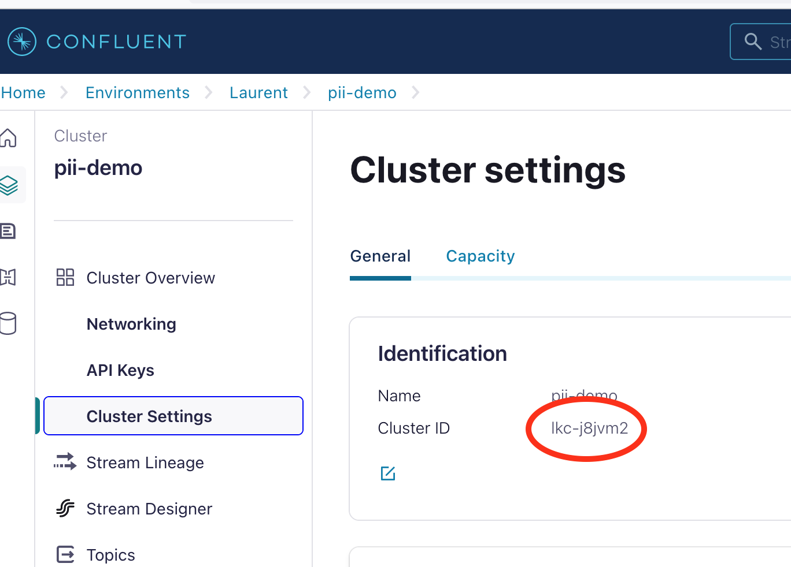

# Hashicorp Vault Confluent Cloud Plugin - Administrator Guide

This document assumes that you have a Vault server up and running. You'll also need a working Confluent Cloud account and cluster.

If you need help setting up Vault, you can consult [Hashicorp Vault's web site](https://www.hashicorp.com/products/vault). It is also useful to look at the way we configure the server in the plugin's demo.

## Setup & Deployment

To install the Vault plugin, you have to register it with Vault and configure it with your Confluent Cloud details (mainly the Cloud API key).   

### Vault setup

Files provided:
- `vault/server.hcl`: example of a minimal Vault server config for the plugin, in HCL format (https://developer.hashicorp.com/vault/docs/configuration)
- `bin/vault-ccloud-secrets-engine`: the plugin's binary

1. Get the directory for plugins from your Vault server and copy the plugin's binary into it.
2. Get the SHA256 sum of the plugin (you can verify it's the same as the one we provide)
```shell
sha256sum bin/vault-ccloud-secrets-engine | cut -d' ' -f1
```
3. Register the plugin: 
```shell
vault plugin register -sha256="<SHA256>" -command="vault-ccloud-secrets-engine" secret ccloud-secrets-engine
```
In the above command, replace `<SHA256>` with the result from step 2.
4. Enable it: 
```shell
vault secrets enable -path="ccloud" -plugin-name="ccloud-secrets-engine" plugin
```
Please note: You can set a default and a maximum duration for leases in this command with the options `-default-lease-ttl` and `-max-lease-ttl` respectively. Read the section on leases below for more details.

### Plugin setup and configuration

The plugin configuration consists simply in providing the CC Cloud API key details.

#### Where to get the information you need:

**CC_CLOUD_API_KEY + CC_CLOUD_API_SECRET**

On the top right menu (aka hamburger menu), click `Cloud API keys`



**CC_OWNER_ID**

The keys created by the plugin are attached to a *user* or *service account* and will have their rights and access. 

If you want to use your user account as the owner:

On the top right menu (aka hamburger menu), click your name, the ID will be in the details in the center box.




if you want to use a service account as the owner:

On the top right menu (aka hamburger menu), click **Accounts & access**, then in the **Accounts** tab, click **Service accounts**, the ID of the desired service account is shown on the 2nd column. Just copy it from there. It should start with `sa-`.

**CC_ENVIRONMENT_ID**

Select the desired environment, then copy its ID from the URL.



**CC_CLUSTER_ID**

Select the desired cluster, then copy its ID from the center box.



#### Plugin config and role

Once you have gathered the various IDs needed, you're ready to configure the role. 

1. Provide the CC Could API key to the plugin:

```shell
vault write ccloud/config ccloud_api_key_id=<CC_CLOUD_API_KEY> ccloud_api_key_secret=<CC_CLOUD_API_SECRET> url="https://api.confluent.cloud"
```

2. Configure the role/app

Under the `role` path, you'll configure your applications' Confluent Cloud API keys. For each role/app, you'll need to provide the owner ID (user ID or service account ID), the environment ID and the cluster ID.

```shell
vault write ccloud/role/app1 name="app1" owner=<CC_OWNER_ID> owner_env=<CC_ENVIRONMENT_ID> resource=<CC_CLUSTER_ID> resource_env=<CC_ENVIRONMENT_ID>
```

To create a role that provides multi-use keys, add the `multi_use_key` option:

```shell
vault write ccloud/role/app1 name="app1" owner=<CC_OWNER_ID> owner_env=<CC_ENVIRONMENT_ID> resource=<CC_CLUSTER_ID> resource_env=<CC_ENVIRONMENT_ID> multi_use_key="true"
```

To provide a custom description for the keys created using the role, add the `key_description` option:

```shell
vault write ccloud/role/app1 name="app1" owner=<CC_OWNER_ID> owner_env=<CC_ENVIRONMENT_ID> resource=<CC_CLUSTER_ID> resource_env=<CC_ENVIRONMENT_ID> key_description="created by the Vault CC plugin for app1"
```

3. Get a key from the plugin = read a Vault secret 

The app will read the secret using the path defined above. Here is an example using the Vault CLI:

```shell
vault read ccloud/creds/app1
```

## The Lease

Not the title of a movie, but simply when a secret is requested to Vault, it returns it with a lease. 

```
Along with the lease ID, a lease duration can be read. The lease duration is a Time To Live value: the time in seconds for which the lease is valid. A consumer of this secret must renew the lease within that time.
```
https://developer.hashicorp.com/vault/docs/concepts/lease

If the lease is not renewed within its TTL, then the lease is revoked and the Confluent Cloud API key may be removed (for situations when it's removed or not, see Key Management Strategies below).

**If the CC API key is removed then your application will not be able to interact with Confluent Cloud anymore.**

To extend a lease:
```shell
vault lease renew -increment=<VALUE> <LEASE-ID>
```

- The lease ID will look like this: `ccloud/creds/app1/2gCWMHufo7RjK6zF5AChPkTn`
- `-increment` is in seconds and defines a new value for the expiry that starts at the time of the command execution.

## Key Management Strategies

### Lease Expiry

When you enable the plugin, a default and maximum lease values are either derived from the global Vault config or from the options you pass when calling the `vault secrets enable` command. 

Let's take an example: if the default lease after the enablement of the plugin is 1 day, when a secret is requested by a client, the lease will have a Time-to-live (TTL) of 1 day. When that 1 day has elapsed, then the lease is revoked and the plugin will **delete the Confluent Cloud API key**. At this point, any application using that key will not be able to get/send data to the CC Kafka cluster anymore.

This means: **The lease expiry is the No 1 thing to think about when deploying an app that is going to use the CC Vault secrets** 

If your model is to restart application every day, then it is fine.

Another possibility is to make the application exit with a specific error number when it loses its Confluent Cloud connection and let the orchestration service restart the app automatically (for example when using Kubernetes). During its initialisation phase, the app will read the secret and a new CC API key will be generated. 

You can of course extend a lease, but that's a manual operation, and it should be avoided. 

Conclusion: **Lease expiry, app deployment model and connection failure code (in the app) must match.**

👉 Our recommendation:
1. A reasonably short TTL, 1 or 2 weeks, for the leases.
2. Write some code inside the app to request a new secret (and CC API key) to the Vault server when the connection fails because the key has been removed. This allows a graceful change of keys and removes the need to adapt the deployment method or orchestration to the lease TTL.  

### Key Quotas

There is a limit of 10 keys per cluster (which can be extended after talking to CC Support), so this behaviour may be a problem for your use-case.

For more details about Confluent Cloud quotas, please read: https://docs.confluent.io/cloud/current/quotas/overview.html

If you have 1 application that you spawn over 5 instance, then each instance will receive its own API key, and you will stay under the 10-key limit. 

However, if you want to use a single key over all the launched instances of an app, then you have to use the multi-use keys. This is an option that you set once  when creating the role with the `vault write ccloud/role/???` command above. 
