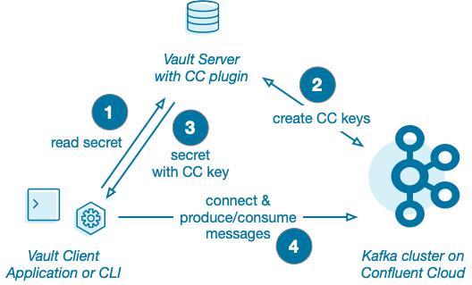

# Hashicorp Vault Confluent Cloud Plugin

The Confluent Cloud plugin for Hashicorp Vault allows applications to automatically generate and store Confluent Cloud keys and secrets as secrets inside Vault.

Benefits from using the Confluent Cloud plugin for Hashicorp Vault:

- Applications connecting to Confluent Cloud do not need to be configured with CC keys and secrets, they only need access to Vault.
- CC keys and secrets can be rotated as often as required.
- The CC Cloud API keys necessary to generate CC keys and secrets are only stored in the plugin's configuration.

Once you've finished reading the present document, if you are a developer looking to modify/understand the plugin, please read [developer.md](developer.md). If you are a system administrator looking to use and configure the plugin, please read [administrator.md](administrator.md).

## How It Works

The Hashicorp Vault Confluent Cloud plugin is a Vault [**secret** plugin](https://developer.hashicorp.com/vault/docs/plugins). It interacts with Confluent Cloud to generate and remove CC API keys and provides them to the Vault clients (either an admin using the CLI `vault secret` command or an application using the Vault SDK).

In its initial steps, a Kafka producer or consumer needs to connect to Vault and query the secret containing the Confluent Cloud Cluster API key. The secret received will contain a valid CC Cluster API key (in the Vault secret's `data` property) and it will use it to authenticate to Confluent Cloud and produce or consumer Kafka messages. 

Depending on the policy set in place by the administrator, they key may expire while the Kafka client is still running. Therefore, it needs to be able to query a new secret to be able to continue interacting with Confluent Cloud. [administrator.md](administrator.md) describes various strategies for dealing with key expiration. 

### Confluent Cloud Cluster API key vs Cloud API key

To connect to and generally use Kafka clusters on Confluent Cloud, an application needs a *Cluster API key*, sometimes shortened as *API key*, as well as its corresponding secret. This key is 16 characters long (eg. `ABCDENUBU5EOYJCH`). The secret is 64 characters long.

To administer or generate *Cluster API* keys, an application or an administrator needs a *Cloud API* key and secret. This key is used to create keys, build environments, provision clusters, etc. A *Cloud API* key and secret needs to be added to the plugin's configuration to allow it to perform its duty. 

## Multi-use vs Per-Instance Keys

By default, the plugin generates and provides a new CC key and secret at each `vault secret read` call. If you start 5 instances of the same application requesting the same secret, the plugin will generate 5 different CC API keys

There is a limit of 10 keys per cluster (which can be extended after talking to CC Support), so this behaviour may be a problem for your use-case. 

For more details about Confluent Cloud quotas, please read: https://docs.confluent.io/cloud/current/quotas/overview.html

To avoid the risk of running short of API keys, a role can be setup to share CC keys within an application. Each instance requesting a secret will get the existing key for a role, so all instances will use the same CC API key. To use multi-use keys, pass `multi_use_key="true"` when calling `vault write` to set the role up. See the Administrator guide for more details.  

(This feature can be also used to share CC keys over several applications, but this is not recommended).

---
Read next 👉 [developer.md](developer.md) • [administrator.md](administrator.md)
